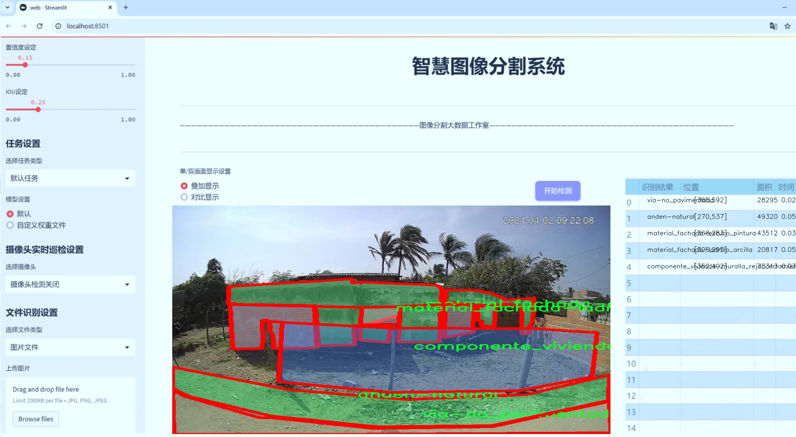
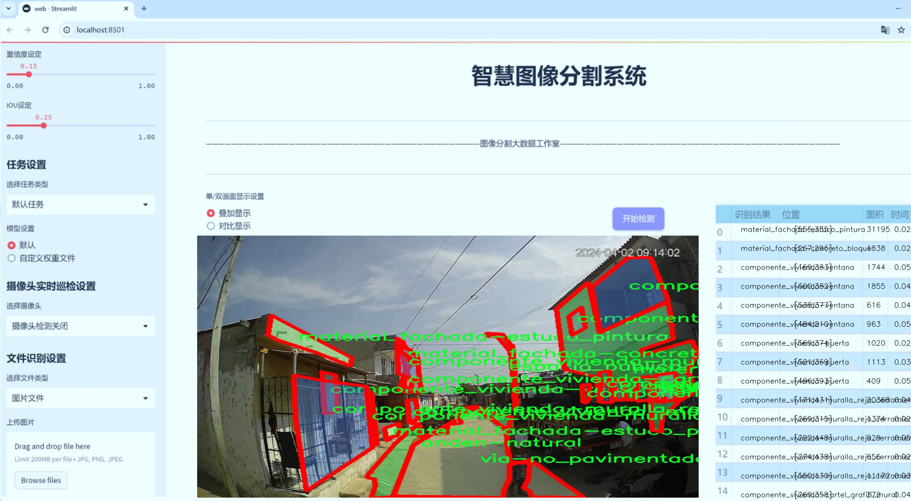
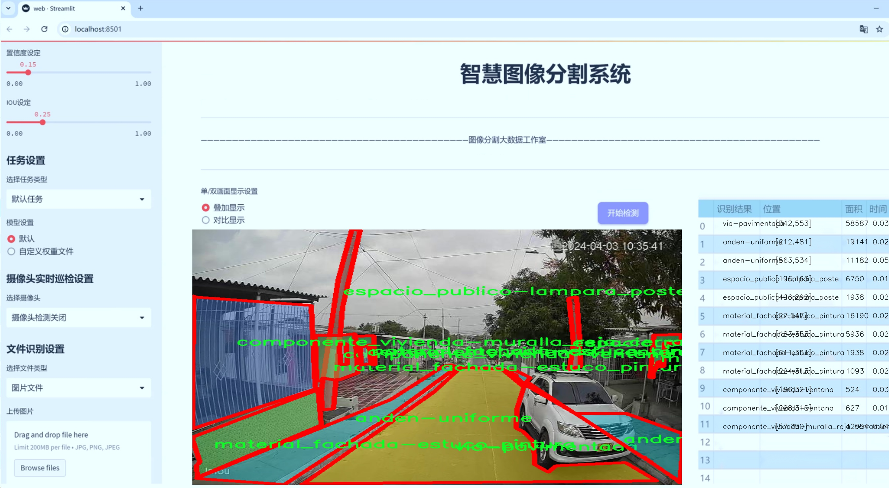
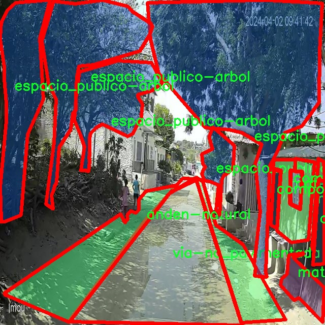
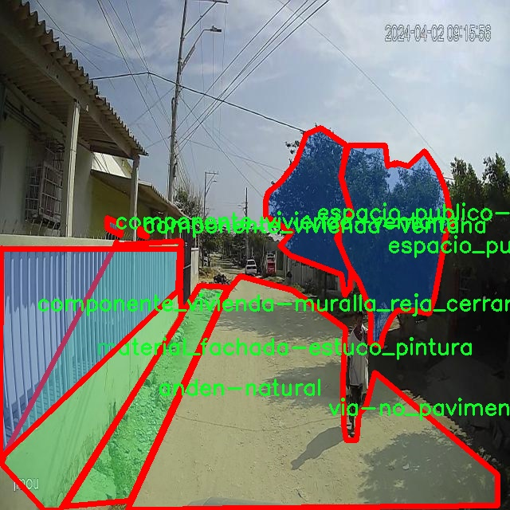
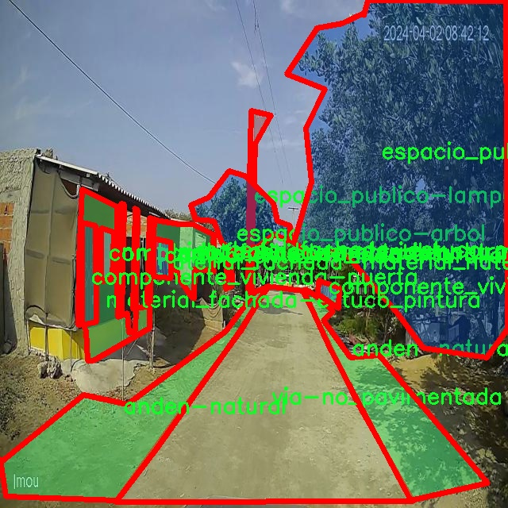
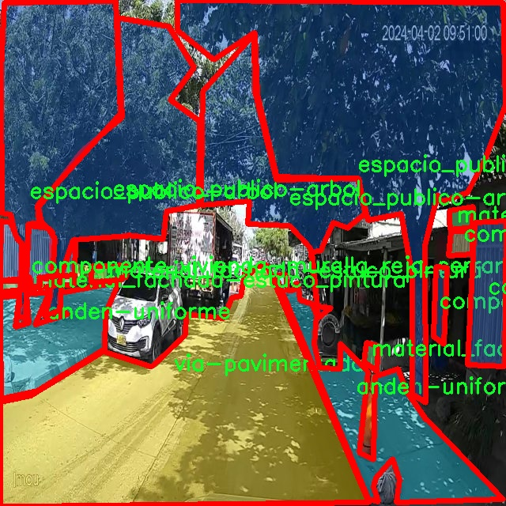
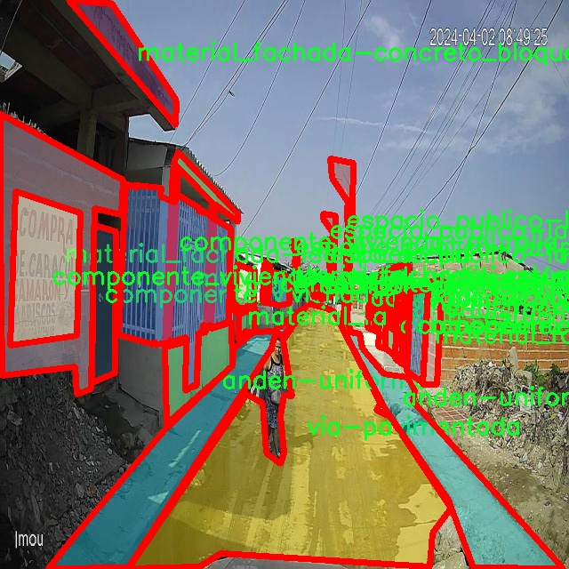

# 城市环境要素分割系统： yolov8-seg-C2f-EMSCP

### 1.研究背景与意义

[参考博客](https://gitee.com/YOLOv8_YOLOv11_Segmentation_Studio/projects)

[博客来源](https://kdocs.cn/l/cszuIiCKVNis)

研究背景与意义

随着城市化进程的加速，城市环境的复杂性和多样性日益显著。城市环境要素的精确识别与分割不仅对城市规划、环境监测、公共安全等领域具有重要意义，同时也为智能城市的建设提供了基础数据支持。近年来，深度学习技术的迅猛发展，尤其是目标检测与分割领域的突破，使得基于卷积神经网络（CNN）的实例分割方法逐渐成为研究热点。YOLO（You Only Look Once）系列模型因其高效的实时检测能力而备受关注，其中YOLOv8作为最新版本，进一步提升了检测精度和速度，成为城市环境要素分割的理想选择。

本研究旨在基于改进的YOLOv8模型，构建一个高效的城市环境要素分割系统。所使用的数据集“barrio”包含1900幅图像，涵盖18个类别，涉及城市环境中的多种要素，如建筑物、公共设施、绿化等。这些类别不仅反映了城市环境的多样性，还体现了城市空间的功能性与美观性。通过对这些要素的精确分割，能够为城市管理者提供详实的数据支持，助力城市环境的可持续发展。

在城市环境的管理与维护中，环境要素的分割与识别是基础性工作。传统的手工标注与分析方法不仅耗时耗力，而且容易受到主观因素的影响，导致数据的不一致性和准确性不足。而基于深度学习的自动化分割系统，能够高效处理大规模数据，提升分割精度，减少人为干预的误差。通过对“barrio”数据集的深入分析与模型训练，本研究将探讨如何优化YOLOv8模型的结构与参数设置，以提高其在城市环境要素分割中的表现。

此外，城市环境要素的分割不仅仅是一个技术问题，更是一个社会问题。准确的环境要素识别可以为城市规划提供科学依据，帮助决策者更好地理解城市空间的利用情况，优化资源配置，提高公共服务的效率。例如，通过对公共设施的分割与分析，可以识别出服务不足的区域，从而为未来的设施建设提供指导。再如，绿化要素的监测与分析，有助于评估城市生态环境的健康状况，推动绿色城市的建设。

综上所述，基于改进YOLOv8的城市环境要素分割系统的研究，不仅具有重要的学术价值，更具备广泛的应用前景。通过本研究的开展，期望能够为城市环境的智能化管理提供新思路，推动城市可持续发展的进程。同时，本研究也将为深度学习在实例分割领域的应用提供新的案例与经验，促进相关技术的进一步发展与完善。

### 2.图片演示







注意：本项目提供完整的训练源码数据集和训练教程,由于此博客编辑较早,暂不提供权重文件（best.pt）,需要按照6.训练教程进行训练后实现上图效果。

### 3.视频演示

[3.1 视频演示](https://www.bilibili.com/video/BV1bsUSYSEyt/)

### 4.数据集信息

##### 4.1 数据集类别数＆类别名

nc: 18
names: ['anden-natural', 'anden-uniforme', 'componente_vivienda-cartel_grafiti_mural', 'componente_vivienda-garaje', 'componente_vivienda-muralla_reja_cerramiento', 'componente_vivienda-puerta', 'componente_vivienda-ventana', 'espacio_publico-arbol', 'espacio_publico-caneca', 'espacio_publico-lampara_poste', 'material_fachada-concreto_bloque', 'material_fachada-estuco_pintura', 'material_fachada-ladrillo_arcilla', 'material_fachada-material_desecho', 'material_fachada-material_natural', 'material_fachada-metal_zinc_laton', 'via-no_pavimentada', 'via-pavimentada']


##### 4.2 数据集信息简介

数据集信息展示

在城市环境要素分割的研究中，数据集的质量和多样性是提升模型性能的关键因素之一。本项目所使用的数据集名为“barrio”，其设计旨在为改进YOLOv8-seg模型提供丰富的训练素材，以便更好地识别和分割城市环境中的各种要素。该数据集包含18个类别，涵盖了城市环境中常见的建筑组件、公共空间元素以及不同的材料特征，能够为模型的训练提供全面的视角。

首先，数据集中的类别包括“anden-natural”和“anden-uniforme”，这两个类别代表了城市中人行道的自然和均匀状态，反映了城市规划与自然环境的和谐共存。此外，数据集中还包含多个与住宅相关的组件，如“componente_vivienda-cartel_grafiti_mural”、“componente_vivienda-garaje”、“componente_vivienda-muralla_reja_cerramiento”、“componente_vivienda-puerta”和“componente_vivienda-ventana”。这些类别不仅展示了城市住宅的多样性，还强调了社区文化的表现形式，例如涂鸦和墙面装饰。

在公共空间的元素方面，数据集同样具有重要的代表性。“espacio_publico-arbol”、“espacio_publico-caneca”和“espacio_publico-lampara_poste”这几个类别，分别代表了城市中的树木、垃圾桶和路灯。这些元素在城市环境中扮演着重要的角色，影响着居民的生活质量和城市的美观程度。通过对这些元素的有效分割，模型能够更好地理解城市环境的结构和功能，从而为后续的城市规划和管理提供数据支持。

此外，数据集中还包含了多种建筑材料的类别，如“material_fachada-concreto_bloque”、“material_fachada-estuco_pintura”、“material_fachada-ladrillo_arcilla”、“material_fachada-material_desecho”、“material_fachada-material_natural”和“material_fachada-metal_zinc_laton”。这些材料类别的多样性不仅反映了城市建筑的风格和构造特点，也为模型提供了丰富的视觉信息，使其能够在不同的环境条件下进行有效的分割和识别。

最后，数据集还包括“via-no_pavimentada”和“via-pavimentada”两个类别，分别代表了城市中的非铺装道路和铺装道路。这些类别的存在使得模型能够识别不同类型的交通环境，进而为交通管理和城市基础设施的优化提供支持。

综上所述，“barrio”数据集以其丰富的类别和多样的环境要素，为改进YOLOv8-seg的城市环境要素分割系统提供了坚实的基础。通过对这些类别的深入学习和分析，模型将能够更准确地理解和处理城市环境中的复杂性，为未来的城市研究和应用提供重要的技术支持。











### 5.项目依赖环境部署教程（零基础手把手教学）

[5.1 环境部署教程链接（零基础手把手教学）](https://www.bilibili.com/video/BV1jG4Ve4E9t/?vd_source=bc9aec86d164b67a7004b996143742dc)


[5.2 安装Python虚拟环境创建和依赖库安装视频教程链接（零基础手把手教学）](https://www.bilibili.com/video/BV1nA4VeYEze/?vd_source=bc9aec86d164b67a7004b996143742dc)

### 6.手把手YOLOV8-seg训练视频教程（零基础手把手教学）

[6.1 手把手YOLOV8-seg训练视频教程（零基础小白有手就能学会）](https://www.bilibili.com/video/BV1cA4VeYETe/?vd_source=bc9aec86d164b67a7004b996143742dc)


按照上面的训练视频教程链接加载项目提供的数据集，运行train.py即可开始训练



     Epoch   gpu_mem       box       obj       cls    labels  img_size
     1/200     0G   0.01576   0.01955  0.007536        22      1280: 100%|██████████| 849/849 [14:42<00:00,  1.04s/it]
               Class     Images     Labels          P          R     mAP@.5 mAP@.5:.95: 100%|██████████| 213/213 [01:14<00:00,  2.87it/s]
                 all       3395      17314      0.994      0.957      0.0957      0.0843

     Epoch   gpu_mem       box       obj       cls    labels  img_size
     2/200     0G   0.01578   0.01923  0.007006        22      1280: 100%|██████████| 849/849 [14:44<00:00,  1.04s/it]
               Class     Images     Labels          P          R     mAP@.5 mAP@.5:.95: 100%|██████████| 213/213 [01:12<00:00,  2.95it/s]
                 all       3395      17314      0.996      0.956      0.0957      0.0845

     Epoch   gpu_mem       box       obj       cls    labels  img_size
     3/200     0G   0.01561    0.0191  0.006895        27      1280: 100%|██████████| 849/849 [10:56<00:00,  1.29it/s]
               Class     Images     Labels          P          R     mAP@.5 mAP@.5:.95: 100%|███████   | 187/213 [00:52<00:00,  4.04it/s]
                 all       3395      17314      0.996      0.957      0.0957      0.0845


### 7.50+种全套YOLOV8-seg创新点加载调参实验视频教程（一键加载写好的改进模型的配置文件）

[7.1 50+种全套YOLOV8-seg创新点加载调参实验视频教程（一键加载写好的改进模型的配置文件）](https://www.bilibili.com/video/BV1Hw4VePEXv/?vd_source=bc9aec86d164b67a7004b996143742dc)

### YOLOV8-seg算法简介

原始YOLOv8-seg算法原理

YOLOv8-seg算法是YOLO系列中最新的目标检测与分割模型，具有更高的精度和更快的推理速度。其核心设计理念在于将目标检测与实例分割相结合，利用深度学习技术对图像中的目标进行精确的定位和分割。YOLOv8-seg的架构由输入层、主干网络、颈部网络和头部网络四个主要部分构成，每个部分在整体功能中扮演着至关重要的角色。

在输入层，YOLOv8-seg首先对输入图像进行预处理，包括图像缩放、数据增强等步骤，以确保输入图像符合模型的要求。数据增强技术如马赛克（mosaic）增强和自适应灰度填充等，能够有效提高模型的鲁棒性和泛化能力。这些预处理步骤为后续的特征提取和目标检测奠定了基础。

主干网络是YOLOv8-seg的核心部分，负责从输入图像中提取丰富的特征信息。该网络采用了先进的卷积神经网络结构，通过一系列卷积层和激活函数（如SiLU）进行特征提取。YOLOv8-seg引入了C2f模块，这一模块的设计灵感来源于YOLOv7中的E-ELAN结构，通过跨层分支连接来增强模型的梯度流，提升特征表示能力。C2f模块的引入，使得模型在学习残差特征时能够更加高效，从而提高了目标检测的精度和速度。此外，主干网络末尾的SPPFl（Spatial Pyramid Pooling Fusion）模块通过多个最大池化层的组合，增强了网络对多尺度特征的处理能力，使得模型能够更好地适应不同尺寸的目标。

颈部网络则是YOLOv8-seg的重要组成部分，主要负责特征的融合与传递。该网络采用了路径聚合网络（PAN）和特征金字塔网络（FPN）结构，能够有效地融合来自不同尺度的特征图信息。通过这种多尺度特征融合，YOLOv8-seg能够更好地捕捉到图像中目标的细节信息，从而提高分割的精度。

在头部网络中，YOLOv8-seg采用了解耦的检测头结构，这一设计使得分类和回归任务可以独立进行，从而提高了模型的灵活性和效率。具体而言，头部网络通过两个并行的卷积分支分别计算目标的类别和位置损失。在损失计算方面，YOLOv8-seg引入了Task-Aligned Assigner策略，根据分类与回归的得分加权结果来选择正样本，从而优化模型的训练过程。分类分支使用二元交叉熵损失（BCELoss），而回归分支则结合了分布焦点损失（DFLoss）和完全交并比损失（CIOULoss），以提升模型对边界框预测的精准性。

YOLOv8-seg的创新之处在于其无锚框（Anchor-Free）检测方式，减少了锚框预测的数量，从而加速了非最大抑制（NMS）过程。这一改进使得YOLOv8-seg在处理复杂场景时，能够更快地进行目标检测与分割，提升了实时性。

在具体应用中，YOLOv8-seg展现出了优越的性能。其在多个标准数据集上的测试结果表明，YOLOv8-seg不仅在检测精度上超越了前代模型，同时在推理速度上也有显著提升。这使得YOLOv8-seg成为实时目标检测与分割任务的理想选择，广泛应用于自动驾驶、视频监控、智能安防等领域。

总的来说，YOLOv8-seg算法通过对网络结构的优化与创新，成功地将目标检测与实例分割结合在一起。其高效的特征提取、精确的多尺度特征融合以及灵活的解耦检测头设计，使得YOLOv8-seg在处理复杂视觉任务时表现出色。随着深度学习技术的不断发展，YOLOv8-seg无疑将为未来的计算机视觉应用带来更多的可能性和机遇。


### 9.系统功能展示（检测对象为举例，实际内容以本项目数据集为准）

图9.1.系统支持检测结果表格显示

  图9.2.系统支持置信度和IOU阈值手动调节

  图9.3.系统支持自定义加载权重文件best.pt(需要你通过步骤5中训练获得)

  图9.4.系统支持摄像头实时识别

  图9.5.系统支持图片识别

  图9.6.系统支持视频识别

  图9.7.系统支持识别结果文件自动保存

  图9.8.系统支持Excel导出检测结果数据


### 10.50+种全套YOLOV8-seg创新点原理讲解（非科班也可以轻松写刊发刊，V11版本正在科研待更新）

#### 10.1 由于篇幅限制，每个创新点的具体原理讲解就不一一展开，具体见下列网址中的创新点对应子项目的技术原理博客网址【Blog】：


[10.1 50+种全套YOLOV8-seg创新点原理讲解链接](https://gitee.com/qunmasj/good)

#### 10.2 部分改进模块原理讲解(完整的改进原理见上图和技术博客链接)【如果此小节的图加载失败可以通过CSDN或者Github搜索该博客的标题访问原始博客，原始博客图片显示正常】
### 可变性卷积DCN简介
卷积神经网络由于其构建模块中固定的几何结构，本质上受限于模型几何变换。为了提高卷积神经网络的转换建模能力，《Deformable Convolutional Networks》作者提出了两个模块：可变形卷积（deformable convolution）和可变形RoI池（deformable RoI pooling）。这两个模块均基于用额外的偏移来增加模块中的空间采样位置以及从目标任务中学习偏移的思想，而不需要额外的监督。

第一次证明了在深度神经网络中学习密集空间变换（dense spatial transformation）对于复杂的视觉任务是有效的

视觉识别中的一个关键挑战是如何适应对象比例、姿态、视点和零件变形中的几何变化或模型几何变换。一般有两种方法实现：
1）建立具有足够期望变化的训练数据集。这通常通过增加现有的数据样本来实现，例如通过仿射变换。但是训练成本昂贵而且模型参数庞大。
2）使用变换不变（transformation-invariant）的特征和算法。比如比较有名的SIFT(尺度不变特征变换)便是这一类的代表算法。

但以上的方法有两个缺点：
1）几何变换被假定为固定的和已知的，这些先验知识被用来扩充数据，设计特征和算法。为此，这个假设阻止了对具有未知几何变换的新任务的推广，从而导致这些几何变换可能没有被正确建模。
2）对于不变特征和算法进行手动设计，对于过于复杂的变换可能是困难的或不可行的。

卷积神经网络本质上局限于模拟大型未知转换。局限性源于CNN模块的固定几何结构：卷积单元在固定位置对输入特征图进行采样；池化层以固定比率降低特征矩阵分辨率；RoI（感兴趣区域）池化层将RoI分成固定的空间箱（spatial bins）等。缺乏处理几何变换的内部机制。

这种内部机制的缺乏会导致一些问题，举个例子。同一个CNN层中所有激活单元的感受野大小是相同的，但是这是不可取的。因为不同的位置可能对应于具有不同尺度或变形的对象，所以尺度或感受野大小的自适应确定对于具有精细定位的视觉识别是渴望的。

对于这些问题，作者提出了两个模块提高CNNs对几何变换建模的能力。


deformable convolution（可变形卷积）
将2D偏移量添加到标准卷积中的常规网格采样位置，使得采样网格能够自由变形。通过额外的卷积层，从前面的特征映射中学习偏移。因此，变形采用局部、密集和自适应的方式取决于输入特征。


deformable RoI pooling（可变形RoI池化）
为先前RoI池化的常规库（bin）分区中的每个库位置（bin partition）增加了一个偏移量。类似地，偏移是从前面的特征图和感兴趣区域中学习的，从而能够对具有不同形状的对象进行自适应部件定位（adaptive part localization）。

#### Deformable Convolutional Networks
Deformable Convolution
2D卷积由两个步骤组成：
1）在输入特征图x xx上使用规则网格R RR进行采样。
2）把这些采样点乘不同权重w ww后相加。

网格R定义感受野大小和扩张程度，比如内核大小为3x3，扩张程度为1的网格R可以表示为：
R = { ( − 1 , − 1 ) , ( − 1 , 0 ) , … , ( 0 , 1 ) , ( 1 , 1 ) } R = \{(-1,-1),(-1,0),\dots,(0,1),(1,1)\}
R={(−1,−1),(−1,0),…,(0,1),(1,1)}

​
 一般为小数，使用双线性插值进行处理。（把小数坐标分解到相邻的四个整数坐标点来计算结果）


具体操作如图所示：


首先对输入特征层进行一个普通的3x3卷积处理得到偏移域（offset field）。偏移域特征图具有与输入特征图相同的空间分辨率，channels维度2N对应于N个2D（xy两个方向）偏移。其中的N是原输入特征图上所具有的N个channels，也就是输入输出channels保持不变，这里xy两个channels分别对输出特征图上的一个channels进行偏移。确定采样点后就通过与相对应的权重w点乘相加得到输出特征图上该点最终值。

前面也提到过，由于这里xy两个方向所训练出来的偏移量一般来说是一个小数，那么为了得到这个点所对应的数值，会采用双线性插值的方法，从最近的四个邻近坐标点中计算得到该偏移点的数值，公式如下：


具体推理过程见：双线性插值原理

#### Deformable RoI Poolingb
所有基于区域提议（RPN）的对象检测方法都使用RoI池话处理，将任意大小的输入矩形区域转换为固定大小的特征图。


 一般为小数，需要使用双线性插值进行处理。


具体操作如图所示：


当时看这个部分的时候觉得有些突兀，明明RoI池化会将特征层转化为固定尺寸的区域。其实，我个人觉得，这个部分与上述的可变性卷积操作是类似的。这里同样是使用了一个普通的RoI池化操作，进行一些列处理后得到了一个偏移域特征图，然后重新作用于原来的w × H w \times Hw×H的RoI。只不过这里不再是规律的逐行逐列对每个格子进行池化，而是对于格子进行偏移后再池化处理。

#### Postion﹣Sensitive RoI Pooling
除此之外，论文还提出一种PS RoI池化（Postion﹣Sensitive RoI Pooling）。不同于上述可变形RoI池化中的全连接过程，这里使用全卷积替换。

具体操作如图所示：


首先，对于原来的特征图来说，原本是将输入特征图上的RoI区域分成k × k k\times kk×k个bin。而在这里，则是将输入特征图进行卷积操作，分别得到一个channels为k 2 ( C + 1 ) k^{2}(C+1)k (C+1)的得分图（score maps）和一个channels为2 k 2 ( C + 1 ) 2k{2}(C+1)2k 2 (C+1)的偏移域（offset fields），这两个特征矩阵的宽高是与输入特征矩阵相同的。其中，得分图的channels中，k × k k \times kk×k分别表示的是每一个网格，C CC表示的检测对象的类别数目，1表示背景。而在偏移域中的2表示xy两个方向的偏移。
也就是说，在PS RoI池化中，对于RoI的每一个网格都独自占一个通道形成一层得分图，然后其对于的偏移量占两个通道。offset fields得到的偏移是归一化后的偏移，需要通过和deformable RoI pooling中一样的变换方式得到∆ p i j ∆p_{ij}∆p ij，然后对每层得分图进行偏移池化处理。最后处理完的结果就对应着最后输出的一个网格。所以其包含了位置信息。

原文论述为：


#### Understanding Deformable ConvNets
当可变形卷积叠加时，复合变形的效果是深远的。如图所示：


ps：a是标准卷积的固定感受野，b是可变形卷积的适应性感受野。

感受野和标准卷积中的采样位置在整个顶部特征图上是固定的(左)。在可变形卷积中，它们根据对象的比例和形状进行自适应调整(右)。


### 11.项目核心源码讲解（再也不用担心看不懂代码逻辑）

#### 11.1 ultralytics\data\loaders.py

以下是对您提供的代码的核心部分进行的分析和详细注释。代码主要涉及YOLOv8模型的输入数据加载，包括视频流、图像、屏幕截图等。为了简化，以下代码保留了最核心的部分，并添加了详细的中文注释。

```python
import cv2
import numpy as np
import torch
from pathlib import Path
from threading import Thread
from urllib.parse import urlparse

class LoadStreams:
    """
    用于加载视频流的类，支持RTSP、RTMP、HTTP和TCP流。
    """

    def __init__(self, sources='file.streams', imgsz=640, vid_stride=1, buffer=False):
        """初始化流加载器，设置源、图像大小、视频步幅和缓冲选项。"""
        torch.backends.cudnn.benchmark = True  # 针对固定大小推理加速
        self.buffer = buffer  # 是否缓冲输入流
        self.running = True  # 线程运行标志
        self.imgsz = imgsz  # 图像大小
        self.vid_stride = vid_stride  # 视频帧率步幅
        sources = Path(sources).read_text().rsplit() if os.path.isfile(sources) else [sources]
        self.sources = [self.clean_str(x) for x in sources]  # 清理源名称
        self.imgs, self.fps, self.frames, self.threads, self.shape = [[]] * len(sources), [0] * len(sources), [0] * len(sources), [None] * len(sources), [[]] * len(sources)
        self.caps = [None] * len(sources)  # 视频捕获对象

        for i, s in enumerate(sources):  # 遍历每个源
            s = eval(s) if s.isnumeric() else s  # 处理数字源（如本地摄像头）
            self.caps[i] = cv2.VideoCapture(s)  # 创建视频捕获对象
            if not self.caps[i].isOpened():
                raise ConnectionError(f'无法打开 {s}')
            # 获取视频的宽、高和帧率
            w = int(self.caps[i].get(cv2.CAP_PROP_FRAME_WIDTH))
            h = int(self.caps[i].get(cv2.CAP_PROP_FRAME_HEIGHT))
            fps = self.caps[i].get(cv2.CAP_PROP_FPS)
            self.frames[i] = max(int(self.caps[i].get(cv2.CAP_PROP_FRAME_COUNT)), 0) or float('inf')  # 无限流回退
            self.fps[i] = max((fps if np.isfinite(fps) else 0) % 100, 0) or 30  # 30 FPS回退

            success, im = self.caps[i].read()  # 读取第一帧
            if not success or im is None:
                raise ConnectionError(f'无法从 {s} 读取图像')
            self.imgs[i].append(im)  # 存储第一帧
            self.shape[i] = im.shape  # 存储图像形状
            self.threads[i] = Thread(target=self.update, args=([i, self.caps[i], s]), daemon=True)  # 启动线程读取帧
            self.threads[i].start()

    def update(self, i, cap, stream):
        """在守护线程中读取视频流的帧。"""
        n = 0  # 帧计数
        while self.running and cap.isOpened():
            if len(self.imgs[i]) < 30:  # 保持缓冲区不超过30帧
                n += 1
                cap.grab()  # 抓取下一帧
                if n % self.vid_stride == 0:  # 根据步幅读取帧
                    success, im = cap.retrieve()
                    if not success:
                        im = np.zeros(self.shape[i], dtype=np.uint8)  # 创建空图像
                    if self.buffer:
                        self.imgs[i].append(im)  # 如果缓冲，添加到列表
                    else:
                        self.imgs[i] = [im]  # 否则替换
            else:
                time.sleep(0.01)  # 等待缓冲区空闲

    def close(self):
        """关闭流加载器并释放资源。"""
        self.running = False  # 停止线程
        for thread in self.threads:
            if thread.is_alive():
                thread.join(timeout=5)  # 等待线程结束
        for cap in self.caps:
            cap.release()  # 释放视频捕获对象

    def __iter__(self):
        """返回迭代器对象。"""
        self.count = -1
        return self

    def __next__(self):
        """返回源路径、图像等供处理。"""
        self.count += 1
        images = []
        for i, x in enumerate(self.imgs):
            while not x:  # 等待帧可用
                time.sleep(1 / min(self.fps))
                x = self.imgs[i]
            images.append(x.pop(0) if self.buffer else x.pop(-1))  # 获取并移除图像
        return self.sources, images, None, ''

    def clean_str(self, s):
        """清理字符串，去除多余空格等。"""
        return s.strip()

# 其他类（LoadScreenshots, LoadImages, LoadPilAndNumpy, LoadTensor）类似于LoadStreams，负责不同来源的图像加载。

def get_best_youtube_url(url):
    """
    从给定的YouTube视频中获取最佳质量的MP4视频流URL。
    """
    # 此处省略实现细节
    pass
```

### 代码分析
1. **LoadStreams类**：该类用于加载视频流，支持多种来源（如RTSP、RTMP等）。它通过OpenCV的`VideoCapture`类读取视频帧，并在后台线程中不断更新帧数据。

2. **update方法**：在后台线程中运行，负责从视频流中抓取帧，并根据设定的步幅（`vid_stride`）决定是否读取帧。

3. **close方法**：负责关闭所有打开的视频流和释放资源。

4. **__iter__和__next__方法**：实现了迭代器协议，使得该类的实例可以被迭代，逐帧返回图像数据。

5. **get_best_youtube_url函数**：用于获取YouTube视频的最佳质量流的URL，具体实现省略。

以上是对代码的核心部分的提炼和注释，旨在帮助理解YOLOv8模型如何处理不同来源的输入数据。

这个文件 `ultralytics\data\loaders.py` 是 Ultralytics YOLO 项目的一部分，主要负责加载和处理图像、视频流和截图等输入数据。文件中定义了多个类和函数，分别用于不同类型的数据加载。

首先，文件导入了一些必要的库，包括文件和路径处理、图像处理、网络请求、以及 PyTorch 等。接着，定义了一个数据类 `SourceTypes`，用于表示不同的输入源类型，比如网络摄像头、截图、图像文件和张量等。

接下来是 `LoadStreams` 类，它用于处理各种视频流，包括 RTSP、RTMP、HTTP 和 TCP 流。该类的构造函数初始化了一些属性，如输入源、图像大小、视频帧率步幅等，并创建线程以从视频流中读取帧。类中还实现了更新、关闭、迭代等方法，以便在处理过程中能够有效地读取和管理视频流。

`LoadScreenshots` 类则专注于处理屏幕截图。它使用 `mss` 库来捕获屏幕，并提供了获取截图的功能。用户可以指定要捕获的屏幕和区域。

`LoadImages` 类负责加载图像和视频文件。它支持从多种格式加载，包括单个图像文件、视频文件以及图像和视频路径的列表。该类会检查文件是否存在，并根据文件类型进行分类处理。

`LoadPilAndNumpy` 类用于从 PIL 和 Numpy 数组加载图像，确保图像格式正确，并支持批处理。

`LoadTensor` 类则处理来自 PyTorch 张量的数据，确保输入的张量符合要求，并提供迭代功能。

此外，文件中还定义了一个 `autocast_list` 函数，用于将不同类型的输入源合并为 Numpy 数组或 PIL 图像的列表。

最后，文件提供了一个 `get_best_youtube_url` 函数，用于从给定的 YouTube 视频 URL 中提取最佳质量的 MP4 视频流地址，支持使用 `pafy` 或 `yt_dlp` 库。

整体来看，这个文件实现了一个灵活且强大的数据加载机制，能够处理多种类型的输入数据，为后续的图像处理和模型推理提供支持。

#### 11.2 ultralytics\models\yolo\segment\predict.py

以下是代码中最核心的部分，并附上详细的中文注释：

```python
# 导入必要的模块和类
from ultralytics.engine.results import Results
from ultralytics.models.yolo.detect.predict import DetectionPredictor
from ultralytics.utils import ops

class SegmentationPredictor(DetectionPredictor):
    """
    SegmentationPredictor类扩展了DetectionPredictor类，用于基于分割模型的预测。
    """

    def __init__(self, cfg=DEFAULT_CFG, overrides=None, _callbacks=None):
        """初始化SegmentationPredictor，设置配置、覆盖参数和回调函数。"""
        super().__init__(cfg, overrides, _callbacks)  # 调用父类的初始化方法
        self.args.task = 'segment'  # 设置任务类型为分割

    def postprocess(self, preds, img, orig_imgs):
        """对每个输入图像的预测结果进行后处理，包括非极大值抑制和掩膜处理。"""
        # 应用非极大值抑制，过滤掉低置信度的预测框
        p = ops.non_max_suppression(preds[0],
                                    self.args.conf,  # 置信度阈值
                                    self.args.iou,   # IOU阈值
                                    agnostic=self.args.agnostic_nms,  # 是否使用类别无关的NMS
                                    max_det=self.args.max_det,  # 最大检测框数量
                                    nc=len(self.model.names),  # 类别数量
                                    classes=self.args.classes)  # 需要检测的类别

        # 如果输入图像不是列表，则将其转换为numpy数组
        if not isinstance(orig_imgs, list):
            orig_imgs = ops.convert_torch2numpy_batch(orig_imgs)

        results = []  # 存储结果的列表
        # 获取第二个输出，处理不同的输出格式
        proto = preds[1][-1] if len(preds[1]) == 3 else preds[1]  
        
        # 遍历每个预测结果
        for i, pred in enumerate(p):
            orig_img = orig_imgs[i]  # 获取原始图像
            img_path = self.batch[0][i]  # 获取图像路径
            
            if not len(pred):  # 如果没有检测到框
                masks = None  # 掩膜设置为None
            elif self.args.retina_masks:  # 如果需要处理Retina掩膜
                # 将预测框的坐标缩放到原始图像的尺寸
                pred[:, :4] = ops.scale_boxes(img.shape[2:], pred[:, :4], orig_img.shape)
                # 处理掩膜
                masks = ops.process_mask_native(proto[i], pred[:, 6:], pred[:, :4], orig_img.shape[:2])  # HWC
            else:  # 处理常规掩膜
                masks = ops.process_mask(proto[i], pred[:, 6:], pred[:, :4], img.shape[2:], upsample=True)  # HWC
                # 缩放预测框的坐标
                pred[:, :4] = ops.scale_boxes(img.shape[2:], pred[:, :4], orig_img.shape)
            
            # 将结果添加到结果列表中
            results.append(Results(orig_img, path=img_path, names=self.model.names, boxes=pred[:, :6], masks=masks))
        
        return results  # 返回处理后的结果
```

### 代码核心部分说明：
1. **类定义**：`SegmentationPredictor` 继承自 `DetectionPredictor`，用于处理图像分割任务。
2. **初始化方法**：在初始化时设置任务类型为分割，并调用父类的初始化方法。
3. **后处理方法**：`postprocess` 方法负责对模型的预测结果进行后处理，包括：
   - 应用非极大值抑制（NMS）来过滤低置信度的检测框。
   - 将输入图像转换为numpy数组格式。
   - 根据预测结果生成掩膜，并将其与原始图像结合，最终返回处理后的结果列表。

这个程序文件 `ultralytics/models/yolo/segment/predict.py` 定义了一个用于图像分割的预测类 `SegmentationPredictor`，它继承自 `DetectionPredictor` 类。该类主要用于处理基于 YOLO 模型的图像分割任务。

在文件的开头，首先导入了一些必要的模块和类，包括 `Results`、`DetectionPredictor` 和一些工具函数 `ops`。这些导入为后续的类定义和方法实现提供了基础。

`SegmentationPredictor` 类的构造函数 `__init__` 接受三个参数：`cfg`（配置），`overrides`（覆盖配置），和 `_callbacks`（回调函数）。在构造函数中，调用了父类的构造函数，并将任务类型设置为 'segment'，这表明该类专注于图像分割任务。

`postprocess` 方法是该类的核心功能之一，它负责对模型的预测结果进行后处理。该方法接受三个参数：`preds`（模型的预测结果），`img`（输入图像），和 `orig_imgs`（原始图像）。在该方法中，首先使用非极大值抑制（NMS）来过滤预测结果，以减少重叠的框。接着，检查输入的原始图像是否为列表，如果不是，则将其转换为 NumPy 数组。

然后，方法会遍历每个预测结果，处理每个图像的分割掩码。如果没有检测到目标，则掩码为 `None`；如果启用了 `retina_masks`，则使用原生处理函数来生成掩码；否则，使用标准的掩码处理函数，并进行必要的上采样。最后，将处理后的结果封装为 `Results` 对象，包括原始图像、图像路径、类别名称、边界框和掩码，并将这些结果存储在一个列表中。

整体来看，这个文件的主要功能是实现图像分割模型的预测，并对预测结果进行后处理，以便于后续的分析和可视化。通过这个类，用户可以方便地使用 YOLO 模型进行图像分割任务，并获得清晰的输出结果。

#### 11.3 ultralytics\nn\modules\__init__.py

```python
# 导入Ultralytics YOLO相关模块
# 这些模块包含了YOLO模型的各个组成部分，例如卷积层、头部、变换器等

from .block import *        # 导入自定义的块模块
from .conv import *         # 导入卷积层模块
from .head import *         # 导入模型头部模块
from .transformer import *   # 导入变换器模块
```

### 代码注释说明：
1. **模块导入**：这段代码的核心在于导入Ultralytics YOLO模型的不同组成部分。通过使用`from ... import *`语法，可以将各个模块中的所有类和函数引入当前命名空间，方便后续使用。
   
2. **模块功能**：
   - `block`：通常包含一些基础构件或组合块，用于构建更复杂的网络结构。
   - `conv`：包含卷积层的实现，卷积层是深度学习模型中最常用的层之一，负责提取特征。
   - `head`：模型的输出部分，通常用于将特征映射转换为最终的预测结果。
   - `transformer`：可能涉及到自注意力机制或其他变换操作，用于增强模型的表达能力。

这段代码是Ultralytics YOLO框架的基础部分，主要负责模块的组织和引入，为后续的模型构建和训练提供支持。

这个程序文件是Ultralytics YOLO（You Only Look Once）项目的一部分，主要用于模块的导入和管理。文件开头的注释部分简要介绍了该模块的功能，并给出了一个示例，展示了如何使用该模块进行可视化。

在示例中，首先导入了必要的库，包括`ultralytics.nn.modules`和`torch`，然后创建了一个形状为(1, 128, 40, 40)的张量`x`，这通常代表一个批次的图像数据。接着，实例化了一个卷积层`Conv`，其输入和输出通道数均为128。随后，使用`torch.onnx.export`函数将该卷积层导出为ONNX格式的模型文件，文件名由模块名称生成。最后，通过命令行工具`onnxsim`对导出的模型进行简化，并打开该文件以便查看。

在文件的最后部分，使用了相对导入的方式引入了多个模块，包括`block`、`conv`、`head`和`transformer`。这些模块可能包含了YOLO模型的不同组件，例如卷积层、网络头部和变换器等，构成了整个神经网络的基础。

总体来说，这个文件的主要作用是组织和导入与YOLO模型相关的各个模块，为后续的模型构建和使用提供便利。

#### 11.4 ultralytics\trackers\utils\kalman_filter.py

以下是简化后的代码，保留了最核心的部分，并添加了详细的中文注释：

```python
import numpy as np
import scipy.linalg

class KalmanFilter:
    """
    简单的卡尔曼滤波器，用于跟踪图像空间中的边界框。
    
    状态空间为8维，包含边界框中心位置 (x, y)、宽度 w、高度 h 及其各自的速度。
    物体运动遵循恒定速度模型。
    """

    def __init__(self):
        """初始化卡尔曼滤波器的模型矩阵和不确定性权重。"""
        ndim, dt = 4, 1.  # 状态维度和时间步长

        # 创建卡尔曼滤波器模型矩阵
        self._motion_mat = np.eye(2 * ndim, 2 * ndim)  # 运动矩阵
        for i in range(ndim):
            self._motion_mat[i, ndim + i] = dt  # 设置速度项
        self._update_mat = np.eye(ndim, 2 * ndim)  # 更新矩阵

        # 不确定性权重
        self._std_weight_position = 1. / 20
        self._std_weight_velocity = 1. / 160

    def initiate(self, measurement):
        """
        从未关联的测量值创建跟踪。

        参数
        ----------
        measurement : ndarray
            边界框坐标 (x, y, w, h)。

        返回
        -------
        (ndarray, ndarray)
            返回新的跟踪的均值向量和协方差矩阵。
        """
        mean_pos = measurement  # 初始位置
        mean_vel = np.zeros_like(mean_pos)  # 初始速度为0
        mean = np.r_[mean_pos, mean_vel]  # 合并位置和速度

        # 初始化协方差矩阵
        std = [
            2 * self._std_weight_position * measurement[3],  # 高度的标准差
            2 * self._std_weight_position * measurement[3],  # 高度的标准差
            1e-2,  # 宽度的标准差
            2 * self._std_weight_position * measurement[3],  # 高度的标准差
            10 * self._std_weight_velocity * measurement[3],  # 速度的标准差
            10 * self._std_weight_velocity * measurement[3],  # 速度的标准差
            1e-5,  # 速度的标准差
            10 * self._std_weight_velocity * measurement[3]   # 速度的标准差
        ]
        covariance = np.diag(np.square(std))  # 协方差矩阵
        return mean, covariance

    def predict(self, mean, covariance):
        """
        执行卡尔曼滤波器的预测步骤。

        参数
        ----------
        mean : ndarray
            上一时间步的状态均值向量。
        covariance : ndarray
            上一时间步的状态协方差矩阵。

        返回
        -------
        (ndarray, ndarray)
            返回预测状态的均值向量和协方差矩阵。
        """
        # 计算运动协方差
        std_pos = [
            self._std_weight_position * mean[3],  # 高度的标准差
            self._std_weight_position * mean[3],  # 高度的标准差
            1e-2,  # 宽度的标准差
            self._std_weight_position * mean[3]   # 高度的标准差
        ]
        std_vel = [
            self._std_weight_velocity * mean[3],  # 速度的标准差
            self._std_weight_velocity * mean[3],  # 速度的标准差
            1e-5,  # 速度的标准差
            self._std_weight_velocity * mean[3]   # 速度的标准差
        ]
        motion_cov = np.diag(np.square(np.r_[std_pos, std_vel]))  # 运动协方差

        # 预测均值和协方差
        mean = np.dot(mean, self._motion_mat.T)
        covariance = np.linalg.multi_dot((self._motion_mat, covariance, self._motion_mat.T)) + motion_cov

        return mean, covariance

    def update(self, mean, covariance, measurement):
        """
        执行卡尔曼滤波器的校正步骤。

        参数
        ----------
        mean : ndarray
            预测状态的均值向量。
        covariance : ndarray
            状态的协方差矩阵。
        measurement : ndarray
            测量向量 (x, y, w, h)。

        返回
        -------
        (ndarray, ndarray)
            返回测量校正后的状态分布。
        """
        # 预测测量空间的均值和协方差
        projected_mean, projected_cov = self.project(mean, covariance)

        # 计算卡尔曼增益
        chol_factor, lower = scipy.linalg.cho_factor(projected_cov, lower=True, check_finite=False)
        kalman_gain = scipy.linalg.cho_solve((chol_factor, lower),
                                             np.dot(covariance, self._update_mat.T).T,
                                             check_finite=False).T
        innovation = measurement - projected_mean  # 创新值

        # 更新均值和协方差
        new_mean = mean + np.dot(innovation, kalman_gain.T)
        new_covariance = covariance - np.linalg.multi_dot((kalman_gain, projected_cov, kalman_gain.T))
        return new_mean, new_covariance

    def project(self, mean, covariance):
        """
        将状态分布投影到测量空间。

        参数
        ----------
        mean : ndarray
            状态的均值向量。
        covariance : ndarray
            状态的协方差矩阵。

        返回
        -------
        (ndarray, ndarray)
            返回投影后的均值和协方差矩阵。
        """
        std = [
            self._std_weight_position * mean[3],  # 高度的标准差
            self._std_weight_position * mean[3],  # 高度的标准差
            1e-1,  # 宽度的标准差
            self._std_weight_position * mean[3]   # 高度的标准差
        ]
        innovation_cov = np.diag(np.square(std))  # 创新协方差

        mean = np.dot(self._update_mat, mean)  # 投影均值
        covariance = np.linalg.multi_dot((self._update_mat, covariance, self._update_mat.T))  # 投影协方差
        return mean, covariance + innovation_cov  # 返回投影后的均值和协方差
```

### 代码说明
1. **KalmanFilter 类**: 这是一个简单的卡尔曼滤波器，用于跟踪图像中的边界框。
2. **__init__ 方法**: 初始化滤波器的运动矩阵和不确定性权重。
3. **initiate 方法**: 从测量值创建跟踪的初始状态，包括均值和协方差。
4. **predict 方法**: 进行状态预测，更新均值和协方差。
5. **update 方法**: 根据新的测量值更新状态，校正均值和协方差。
6. **project 方法**: 将状态分布投影到测量空间，返回投影后的均值和协方差。

此代码的核心部分是卡尔曼滤波器的基本操作，包括初始化、预测和更新步骤。

这个程序文件实现了一个简单的卡尔曼滤波器，用于在图像空间中跟踪边界框。卡尔曼滤波器是一种递归滤波器，能够估计动态系统的状态，尤其适用于处理带有噪声的测量数据。该文件定义了两个类：`KalmanFilterXYAH`和`KalmanFilterXYWH`，分别用于处理不同格式的边界框。

`KalmanFilterXYAH`类用于处理包含中心位置（x, y）、长宽比（a）和高度（h）的边界框。其状态空间是8维的，包含位置、长宽比、高度及其对应的速度。初始化时，构造了运动模型矩阵和观测模型矩阵，并设定了运动和观测的不确定性权重。该类提供了多个方法，包括初始化跟踪、预测状态、投影状态到测量空间、更新状态以及计算门控距离等。

`initiate`方法用于从未关联的测量创建跟踪，返回新的状态均值和协方差矩阵。`predict`方法实现了卡尔曼滤波的预测步骤，更新状态均值和协方差矩阵。`project`方法将状态分布投影到测量空间，`update`方法则执行卡尔曼滤波的校正步骤，通过测量更新状态。`gating_distance`方法计算状态分布与测量之间的门控距离，帮助判断测量是否与当前状态相关。

`KalmanFilterXYWH`类继承自`KalmanFilterXYAH`，用于处理包含中心位置（x, y）、宽度（w）和高度（h）的边界框。它重写了`initiate`、`predict`、`project`和`update`方法，以适应新的状态表示。

整体来看，这个文件实现了卡尔曼滤波器的基本功能，能够在动态环境中有效地跟踪目标，适用于计算机视觉领域中的目标检测和跟踪任务。通过不同的状态表示，提供了灵活性以适应不同的应用场景。

#### 11.5 log.py

以下是代码中最核心的部分，并附上详细的中文注释：

```python
import os
import time
import cv2
import pandas as pd
from PIL import Image

def save_chinese_image(file_path, image_array):
    """
    保存带有中文路径的图片文件

    参数：
    file_path (str): 图片的保存路径，应包含中文字符
    image_array (numpy.ndarray): 要保存的 OpenCV 图像（即 numpy 数组）
    """
    try:
        # 将 OpenCV 图片转换为 Pillow Image 对象
        image = Image.fromarray(cv2.cvtColor(image_array, cv2.COLOR_BGR2RGB))

        # 使用 Pillow 保存图片文件
        image.save(file_path)

        print(f"成功保存图像到: {file_path}")
    except Exception as e:
        print(f"保存图像失败: {str(e)}")

class LogTable:
    def __init__(self, csv_file_path=None):
        """
        初始化类实例。

        参数：
        csv_file_path (str): 保存初始数据的CSV文件路径。
        """
        self.csv_file_path = csv_file_path
        self.data = pd.DataFrame(columns=['文件路径', '识别结果', '位置', '面积', '时间'])

        # 尝试从CSV文件加载数据，如果失败则创建一个空的DataFrame
        if csv_file_path and os.path.exists(csv_file_path):
            self.data = pd.read_csv(csv_file_path, encoding='utf-8')

    def add_log_entry(self, file_path, recognition_result, position, confidence, time_spent):
        """
        向日志中添加一条新记录。

        参数：
        file_path (str): 文件路径
        recognition_result (str): 识别结果
        position (str): 位置
        confidence (float): 置信度
        time_spent (float): 用时（通常是秒或毫秒）

        返回：
        None
        """
        # 创建新的数据行
        new_entry = pd.DataFrame([[file_path, recognition_result, position, confidence, time_spent]],
                                 columns=['文件路径', '识别结果', '位置', '面积', '时间'])

        # 将新行添加到DataFrame中
        self.data = pd.concat([new_entry, self.data]).reset_index(drop=True)

    def save_to_csv(self):
        """
        将更新后的DataFrame保存到CSV文件
        """
        self.data.to_csv(self.csv_file_path, index=False, encoding='utf-8', mode='a', header=False)

```

### 代码核心部分说明：

1. **`save_chinese_image` 函数**：
   - 该函数用于保存带有中文路径的图片文件。它接收一个文件路径和一个图像数组作为参数，使用Pillow库将OpenCV格式的图像转换为Pillow格式，然后保存到指定路径。

2. **`LogTable` 类**：
   - 该类用于管理日志记录，包含初始化、添加日志条目和保存到CSV文件的功能。
   - `__init__` 方法：初始化类实例，尝试从指定的CSV文件加载数据，如果文件不存在，则创建一个空的DataFrame。
   - `add_log_entry` 方法：用于向日志中添加新记录，接收文件路径、识别结果、位置、置信度和用时等信息，并将其存储在DataFrame中。
   - `save_to_csv` 方法：将更新后的DataFrame保存到CSV文件中。

这些核心部分构成了图像保存和日志记录的基本功能。

这个程序文件 `log.py` 是一个用于处理图像和记录检测结果的 Python 脚本。它主要依赖于几个库，包括 OpenCV、Pandas、Pillow 和 NumPy，功能包括保存带有中文路径的图像、记录检测结果、管理图像和结果数据等。

首先，程序定义了一个函数 `save_chinese_image`，用于保存带有中文字符的文件路径的图像。该函数接受两个参数：文件路径和图像数组。它使用 Pillow 库将 OpenCV 图像转换为 Pillow 图像对象，然后保存到指定路径。如果保存失败，会捕获异常并打印错误信息。

接下来，程序定义了一个 `ResultLogger` 类，用于记录检测结果。该类在初始化时创建一个空的 Pandas DataFrame，包含四个列：识别结果、位置、面积和时间。`concat_results` 方法用于将新的检测结果添加到 DataFrame 中，接收检测结果、位置、置信度和时间作为参数，并返回更新后的 DataFrame。

另一个类 `LogTable` 负责管理图像和结果的记录。它的初始化方法接受一个可选的 CSV 文件路径，如果该文件存在，则从中加载数据；如果不存在，则创建一个空的 DataFrame。该类提供了多个方法，包括 `add_frames` 用于添加图像和检测信息，`clear_frames` 用于清空保存的图像和结果，`save_frames_file` 用于保存图像或视频文件，`add_log_entry` 用于向日志中添加新记录，`clear_data` 用于清空数据，`save_to_csv` 用于将数据保存到 CSV 文件，以及 `update_table` 用于更新表格以显示最新的记录。

在 `save_frames_file` 方法中，程序检查保存的图像列表是否为空。如果只有一张图像，则将其保存为 PNG 文件；如果有多张图像，则将其保存为 AVI 格式的视频。该方法还会根据传入的参数生成文件名，并使用 OpenCV 的 `VideoWriter` 类来创建视频文件。

总的来说，这个程序提供了一套完整的功能来处理图像、记录检测结果并将其保存到 CSV 文件中，适合用于图像处理和结果记录的应用场景。

### 12.系统整体结构（节选）

### 程序整体功能和构架概括

该程序是 Ultralytics YOLO 项目的一部分，主要用于目标检测和图像分割任务。程序的整体架构分为几个模块，每个模块负责特定的功能，协同工作以实现高效的图像处理和目标跟踪。以下是各个模块的主要功能：

1. **数据加载**：`ultralytics\data\loaders.py` 负责加载和处理输入数据，包括图像、视频流和截图等，为后续的模型推理提供支持。
2. **模型预测**：`ultralytics\models\yolo\segment\predict.py` 实现了图像分割模型的预测功能，并对预测结果进行后处理，以便于分析和可视化。
3. **神经网络模块**：`ultralytics\nn\modules\__init__.py` 组织和导入与 YOLO 模型相关的各个模块，为模型构建提供基础。
4. **卡尔曼滤波器**：`ultralytics\trackers\utils\kalman_filter.py` 实现了卡尔曼滤波器，用于在动态环境中跟踪目标，适用于目标检测和跟踪任务。
5. **日志记录**：`log.py` 提供了一套功能来处理图像、记录检测结果并将其保存到 CSV 文件中，适合用于图像处理和结果记录的应用场景。

### 文件功能整理表

| 文件路径                                       | 功能描述                                               |
|------------------------------------------------|--------------------------------------------------------|
| `ultralytics\data\loaders.py`                 | 加载和处理输入数据，包括图像、视频流和截图等。         |
| `ultralytics\models\yolo\segment\predict.py`  | 实现图像分割模型的预测功能，并对预测结果进行后处理。   |
| `ultralytics\nn\modules\__init__.py`          | 组织和导入与 YOLO 模型相关的各个模块。                 |
| `ultralytics\trackers\utils\kalman_filter.py` | 实现卡尔曼滤波器，用于动态环境中的目标跟踪。           |
| `log.py`                                       | 处理图像、记录检测结果并将其保存到 CSV 文件中。       |

通过这些模块的协作，Ultralytics YOLO 项目能够高效地进行目标检测、图像分割和结果记录，适用于各种计算机视觉应用。

### 13.图片、视频、摄像头图像分割Demo(去除WebUI)代码

在这个博客小节中，我们将讨论如何在不使用WebUI的情况下，实现图像分割模型的使用。本项目代码已经优化整合，方便用户将分割功能嵌入自己的项目中。
核心功能包括图片、视频、摄像头图像的分割，ROI区域的轮廓提取、类别分类、周长计算、面积计算、圆度计算以及颜色提取等。
这些功能提供了良好的二次开发基础。

### 核心代码解读

以下是主要代码片段，我们会为每一块代码进行详细的批注解释：

```python
import random
import cv2
import numpy as np
from PIL import ImageFont, ImageDraw, Image
from hashlib import md5
from model import Web_Detector
from chinese_name_list import Label_list

# 根据名称生成颜色
def generate_color_based_on_name(name):
    ......

# 计算多边形面积
def calculate_polygon_area(points):
    return cv2.contourArea(points.astype(np.float32))

...
# 绘制中文标签
def draw_with_chinese(image, text, position, font_size=20, color=(255, 0, 0)):
    image_pil = Image.fromarray(cv2.cvtColor(image, cv2.COLOR_BGR2RGB))
    draw = ImageDraw.Draw(image_pil)
    font = ImageFont.truetype("simsun.ttc", font_size, encoding="unic")
    draw.text(position, text, font=font, fill=color)
    return cv2.cvtColor(np.array(image_pil), cv2.COLOR_RGB2BGR)

# 动态调整参数
def adjust_parameter(image_size, base_size=1000):
    max_size = max(image_size)
    return max_size / base_size

# 绘制检测结果
def draw_detections(image, info, alpha=0.2):
    name, bbox, conf, cls_id, mask = info['class_name'], info['bbox'], info['score'], info['class_id'], info['mask']
    adjust_param = adjust_parameter(image.shape[:2])
    spacing = int(20 * adjust_param)

    if mask is None:
        x1, y1, x2, y2 = bbox
        aim_frame_area = (x2 - x1) * (y2 - y1)
        cv2.rectangle(image, (x1, y1), (x2, y2), color=(0, 0, 255), thickness=int(3 * adjust_param))
        image = draw_with_chinese(image, name, (x1, y1 - int(30 * adjust_param)), font_size=int(35 * adjust_param))
        y_offset = int(50 * adjust_param)  # 类别名称上方绘制，其下方留出空间
    else:
        mask_points = np.concatenate(mask)
        aim_frame_area = calculate_polygon_area(mask_points)
        mask_color = generate_color_based_on_name(name)
        try:
            overlay = image.copy()
            cv2.fillPoly(overlay, [mask_points.astype(np.int32)], mask_color)
            image = cv2.addWeighted(overlay, 0.3, image, 0.7, 0)
            cv2.drawContours(image, [mask_points.astype(np.int32)], -1, (0, 0, 255), thickness=int(8 * adjust_param))

            # 计算面积、周长、圆度
            area = cv2.contourArea(mask_points.astype(np.int32))
            perimeter = cv2.arcLength(mask_points.astype(np.int32), True)
            ......

            # 计算色彩
            mask = np.zeros(image.shape[:2], dtype=np.uint8)
            cv2.drawContours(mask, [mask_points.astype(np.int32)], -1, 255, -1)
            color_points = cv2.findNonZero(mask)
            ......

            # 绘制类别名称
            x, y = np.min(mask_points, axis=0).astype(int)
            image = draw_with_chinese(image, name, (x, y - int(30 * adjust_param)), font_size=int(35 * adjust_param))
            y_offset = int(50 * adjust_param)

            # 绘制面积、周长、圆度和色彩值
            metrics = [("Area", area), ("Perimeter", perimeter), ("Circularity", circularity), ("Color", color_str)]
            for idx, (metric_name, metric_value) in enumerate(metrics):
                ......

    return image, aim_frame_area

# 处理每帧图像
def process_frame(model, image):
    pre_img = model.preprocess(image)
    pred = model.predict(pre_img)
    det = pred[0] if det is not None and len(det)
    if det:
        det_info = model.postprocess(pred)
        for info in det_info:
            image, _ = draw_detections(image, info)
    return image

if __name__ == "__main__":
    cls_name = Label_list
    model = Web_Detector()
    model.load_model("./weights/yolov8s-seg.pt")

    # 摄像头实时处理
    cap = cv2.VideoCapture(0)
    while cap.isOpened():
        ret, frame = cap.read()
        if not ret:
            break
        ......

    # 图片处理
    image_path = './icon/OIP.jpg'
    image = cv2.imread(image_path)
    if image is not None:
        processed_image = process_frame(model, image)
        ......

    # 视频处理
    video_path = ''  # 输入视频的路径
    cap = cv2.VideoCapture(video_path)
    while cap.isOpened():
        ret, frame = cap.read()
        ......
```


### 14.完整训练+Web前端界面+50+种创新点源码、数据集获取


# [下载链接：https://mbd.pub/o/bread/Z5iZl5Zy](https://mbd.pub/o/bread/Z5iZl5Zy)